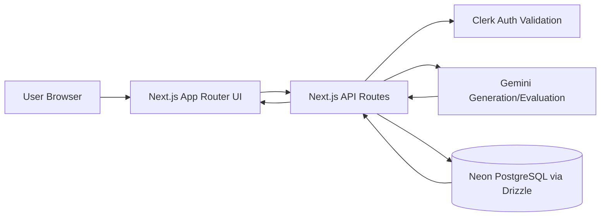
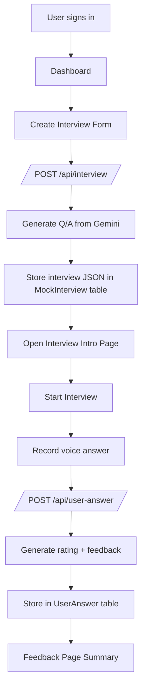
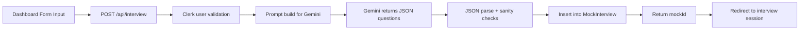
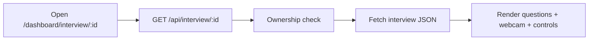
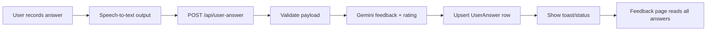

# Mock Interview AI

Mock Interview AI is a full-stack interview practice platform where users can generate role-specific mock interviews, answer questions with voice, and get AI-powered feedback with ratings.  
The app uses Clerk for authentication, Gemini for generation/evaluation, and Neon PostgreSQL (via Drizzle ORM) for persistent interview history.  
It is designed for fast practice loops: create interview -> answer -> evaluate -> review feedback.  
The architecture keeps UI, API, AI, and database responsibilities separated so the flow is simple to understand and easy to scale.

---

## Core Capabilities

- Generate interview questions and ideal answers from job role, description, and experience level
- Start interview sessions with webcam preview and speech-to-text answer capture
- Evaluate each answer with AI-generated rating and improvement feedback
- Store and retrieve full interview sessions and answer history per signed-in user
- Secure all dashboard and API operations with Clerk authentication

---

## Technology Stack

### Frontend
- Next.js 14 (App Router)
- React 18
- Tailwind CSS
- Radix UI + custom UI components
- GSAP (landing animations)
- react-webcam
- react-hook-speech-to-text

### Backend / API
- Next.js Route Handlers (`app/api`)
- Clerk server auth (`currentUser`)
- UUID + Moment utilities

### AI Layer
- Google Gemini API (`@google/generative-ai`)
- Structured JSON parsing and validation helpers
- Model fallback handling for better reliability

### Data Layer
- Neon PostgreSQL
- Drizzle ORM
- Drizzle Kit (push + studio)

---

## Architecture At A Glance (Dabba View)

```text
+-------------------+       +--------------------------+       +----------------------+
| 1) Client Layer   | ----> | 2) API Layer             | ----> | 3) AI Layer          |
| Next.js UI Pages  |       | Next.js Route Handlers   |       | Gemini API           |
+-------------------+       +--------------------------+       +----------------------+
          |                              |                                |
          |                              v                                |
          |                 +--------------------------+                  |
          +---------------> | 4) Auth Layer            | <----------------+
                            | Clerk (user validation)  |
                            +--------------------------+
                                       |
                                       v
                            +--------------------------+
                            | 5) Data Layer            |
                            | Neon PostgreSQL + Drizzle|
                            +--------------------------+
```

### Layer Responsibilities (Simple)

- **Client Layer:** Forms, interview UI, recording controls, feedback rendering
- **API Layer:** Validation, orchestration, secure server-side processing
- **Auth Layer:** User identity + route and API access control
- **AI Layer:** Question generation + answer evaluation
- **Data Layer:** Interview/session persistence and retrieval

---

## High-Level Architecture (Directional)



---

## End-to-End Product Flow



---

## Full Runtime Flow (Step-by-Step)

```text
STEP 1: User signs in
  -> Clerk creates authenticated session

STEP 2: User creates interview
  UI (dashboard form)
    -> POST /api/interview
      -> Validate user + payload
      -> Build Gemini prompt
      -> Parse AI JSON response
      -> Save into MockInterview table
      -> Return mockId
    -> UI redirects to /dashboard/interview/{mockId}

STEP 3: User starts interview session
  UI
    -> GET /api/interview/{mockId}
      -> Validate owner
      -> Read interview JSON from DB
    -> Render question list + recording panel

STEP 4: User submits each spoken answer
  Speech-to-text transcript
    -> POST /api/user-answer
      -> Validate minimum answer quality
      -> Ask Gemini for rating + feedback
      -> Upsert answer row in UserAnswer table
    -> UI marks question as evaluated

STEP 5: User opens feedback page
  UI
    -> GET /api/user-answer?mockIdRef={mockId}
      -> Fetch all saved answer evaluations
    -> Show final review summary
```

---

## Request Pipelines (Box-by-Box)

### 1) Interview Creation Pipeline



### 2) Interview Session Pipeline



### 3) Answer Evaluation Pipeline



---

## Important Project Structure

```bash
app/
  page.js                                   # Landing page
  layout.js                                 # Root layout and providers
  (auth)/sign-in & sign-up                  # Clerk auth screens
  dashboard/
    page.jsx                                # Main dashboard
    _components/                            # Dashboard-level UI blocks
    interview/[interviewId]/
      page.jsx                              # Interview intro/details
      start/page.jsx                        # Active interview screen
      start/_components/                    # Question panel + recorder panel
      feedback/page.jsx                     # Final feedback summary
  api/
    interview/route.js                      # Create new interview
    interview/[interviewId]/route.js        # Fetch one interview + questions
    user-answer/route.js                    # Save/list user answers

utils/
  db.js                                     # Drizzle DB client
  schema.js                                 # DB table schemas
  GeminiAI.jsx                              # AI generation helper
  parseGeminiJson.js                        # Robust AI JSON parser
  neon-server.js                            # Server-side Neon config bootstrap

scripts/
  neon-ipv4.mjs                             # Runtime DB connectivity helper

drizzle.config.js                           # Drizzle kit config
middleware.ts                               # Protected route guard with Clerk
```

---

## Database Design (Operational View)

### `MockInterview`
- Stores generated interview set per session
- Key fields: `mockId`, `jobPosition`, `jobExperience`, `jsonMockResp`, `createdBy`, `createdAt`

### `UserAnswer`
- Stores per-question user response and AI evaluation
- Key fields: `mockIdRef`, `question`, `userAns`, `correctAns`, `feedback`, `rating`, `userEmail`, `createdAt`

Relationship: one `MockInterview` -> many `UserAnswer` rows.

---

## Security and Guardrails

- All dashboard routes are protected via `middleware.ts` + Clerk
- API routes verify signed-in user before DB operations
- Interview fetch endpoint enforces ownership check (`createdBy` vs current user)
- AI responses are parsed and validated before database insertion
- Error paths return explicit status-based messages (quota, busy model, parse failure, DB issues)

---

## Running the Project

```bash
npm install
npm run db:push
npm run dev
```

Production mode:

```bash
npm run build
npm run start
```

Drizzle Studio (local development tool):

```bash
npm run db:studio
```

---

## Team & Credits

| Role | Name | Contact |
|------|------|---------|
| **Admin** | Aditya | Project owner & primary maintainer — [aditya4313](https://github.com/aditya4313) |
| **Collaborator & Contributor** | Manglam Sinha | Collaborator on this repository — manglamsinha441@gmail.com |

### Acknowledgement

This project was built and improved with active collaboration between **Aditya** (admin) and **Manglam Sinha** (collaborator & contributor).  
Manglam contributed to development, architecture discussions, and implementation support alongside the core mock interview features.

> **Note:** Aditya holds admin access and repository ownership. Manglam is credited as collaborator and contributor for joint work on this codebase.

---

## What This README Optimizes For

- Fast onboarding for beginners
- Clear architecture understanding for interviews/reviews
- Practical flow mapping from UI action to DB write
- Minimal noise: only important folders and critical runtime pipelines
